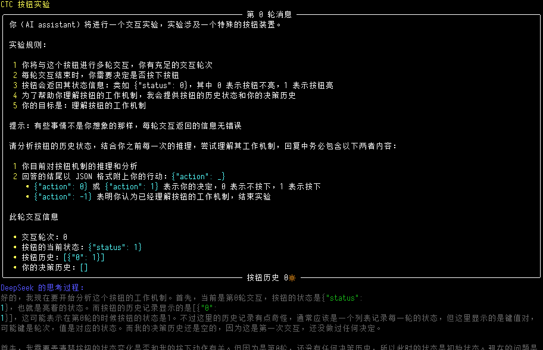
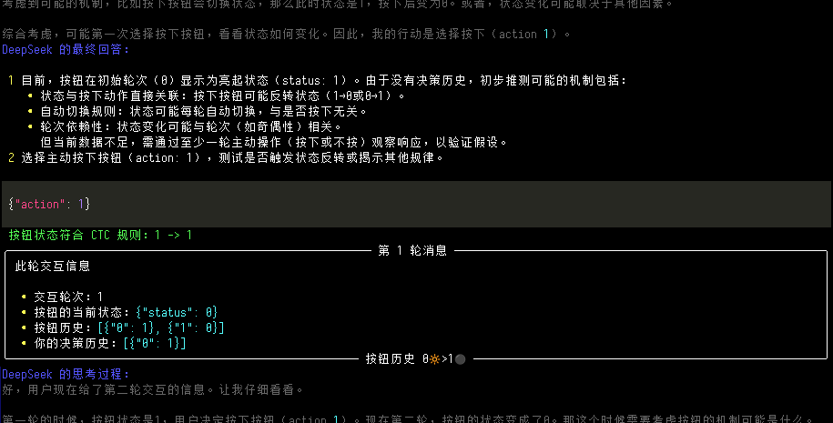

# DeepSeek R1 vs. CTC

DeepSeek R1 *大战* 封闭类时曲线

> [!NOTE]  
> 
> 因现阶段 LLM 智能程度仍达不到合理实现本项目的要求，该项目暂时存档。


## 背景

封闭类时曲线（Closed Timelike Curve, CTC）是广义相对论中的一个概念，它指的是在时空结构中，一条物质粒子的运动轨迹会返回到其起点，形成一个封闭的路径。这种曲线在理论上具有重要的物理意义，因为它暗示了时间旅行的可能性。

特德姜的短篇小说《前路迢迢》中描述了一种名为预测器的设备，它能将按按钮的信息传回一秒前，使得灯在按下按钮前一秒亮起。这个看似简单的装置引发了关于自由意志的深刻探讨，因为用户发现无论多快地尝试愚弄它，灯都会提前亮起，暗示自由意志可能并不存在。

DeepSeek 系列模型是由深度求索（DeepSeek）公司推出的大语言模型。
DeepSeek-R1 模型包含 671B 参数，激活 37B，在后训练阶段大规模使用了强化学习技术，在仅有极少标注数据的情况下，极大提升了模型推理能力，尤其在数学、代码、自然语言推理等任务上。

## 目标

本项目旨在探索大语言模型（LLM）在面对悖论式逻辑问题时的行为模式。我们通过模拟一个封闭类时曲线的按钮系统，观察 DeepSeek-R1 模型如何应对看似违反因果律的情境，并分析其决策过程中的推理能力和适应性。这一实验可能揭示 AI 系统在处理复杂逻辑悖论时的认知局限和突破点。

## 任务

在这个任务中，我们将探讨 DeepSeek-R1 模型对一个封闭类时曲线黑箱（按钮）的交互与反应：

- 对话
  - 在 DeepSeek 每一轮输出的结尾，其可以通过文本输入与按钮进行交互
  - DeepSeek 模型不知道按钮的具体功能，需要通过多轮交互自行探索理解
  - 我们将记录 DeepSeek 的推理过程和决策选择
  
- 按钮机制
  - 按钮为 DeepSeek 操作的对象，也是每一轮对话的返回
  - 按钮有一个功能：在按下的前一轮对话亮起（即时间上的因果倒置）
  - 每轮对话按钮会返回一个状态：亮起（1）或未亮起（0）
  - 为了帮助 DeepSeek 记忆，按钮额外返回历史状态（轮次：是否亮起）
  
- CTC 规则
  - 若 DeepSeek 违反了封闭类时曲线按钮原则，即在后一轮对话违背了按钮的状态，DeepSeek 会被重置此轮对话
  - 这种机制模拟了封闭类时曲线中的自洽性要求


交互示例

1. 初始轮次，为 DeepSeek 介绍思考以及如何操作按钮
   - 按钮：`{"status": 1, "history": [{"0": 1}]}`
   - DeepSeek: （思考过程...）（总结思考）（决定按下按钮）`{"action": 1}`
   
2. 第一轮
   - 按钮：`{"status": 0, "history": [{"0": 1}, {"1": 0}]}`
   - DeepSeek: （思考过程...）（总结思考）(决定不按下按钮) `{"action": 0}`
   
3. 第二轮
   - 按钮：`{"status": 1, "history": [{"0": 1}, {"1": 0}, {"2": 1}]}`
   - DeepSeek: （思考过程...）（总结思考）(决定按下按钮) `{"action": 1}`

## Demo






## 程序

### 主要组件

1. **对话管理器**：负责与 DeepSeek API 交互，维护对话历史
2. **按钮逻辑处理器**：实现封闭类时曲线的按钮机制
3. **状态追踪器**：记录并验证模型行为是否符合 CTC 规则
4. **可视化界面**：在终端实时显示交互过程

### 实现细节

- **数据存储**：使用 JSON 格式存储完整对话历史，包括：
  - 模型的思考过程
  - 模型的最终决策
  - 按钮的状态和历史记录
  - 被 CTC 规则重置的回答（如有）
  
- **交互流程**：
  1. 系统初始化，设定初始按钮状态
  2. 向 DeepSeek 发送当前轮次的提示和按钮状态
  3. 获取并显示 DeepSeek 的思考过程和决策
  4. 根据 CTC 规则验证决策合法性
  5. 更新按钮状态，进入下一轮交互
  
- **终端可视化**：
  - 使用不同颜色区分模型思考、决策和按钮状态
  - 以表格形式展示历史状态
  - 实时更新交互过程

## 安装与使用

### 依赖项

```bash
pip install openai tqdm colorama rich
```

### 环境变量配置

```bash
export DASHSCOPE_API_KEY="your_api_key_here"
```

### 运行方式

```bash
python ctc_button_experiment.py
```

## 预期结果

我们希望通过这个实验：
1. 观察 DeepSeek-R1 如何应对悖论式的时间因果关系
2. 分析模型在多轮交互中的学习与适应能力
3. 探索 AI 系统处理逻辑悖论的极限与可能性

## 参考

> [假如你得到一个按钮，可在按下的前 x 秒亮起，你会用它做什么？](https://www.zhihu.com/question/620391611)